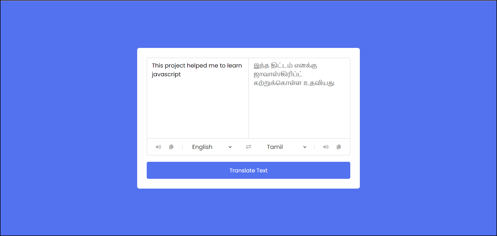

# Language-Translator-App

Welcome to the Language Translator App project! This project implements a language translation application using  MyMemory Translation API, allowing users to translate text between different languages.

<h1>Table of Contents</h1>
<ul>
  <li>Features</li>
  <li>Tech Stack</li>
  <li>Demo</li>
  <li>Installation</li>
</ul>

<h2>Features</h2>
<ul>
  <li><b>Translation:</b> Allows users to translate text from one language to another.</li>
  <li><b>Multiple Languages: </b>Supports translation between a wide range of languages.</li>
  <li><b>Simple Interface: </b> Provides a user-friendly interface for entering text and viewing translations.</li>
</ul>

<h2>Tech Stack</h2>
<ul>
  <li>HTML</li>
  <li>CSS</li>
  <li>JS</li>
</ul>

<h2>Demo</h2>

<h2>Installation</h2>
To install and run this game locally, follow these steps:
<li><b>Clone the repository:</b></li>
<code>git clone https://github.com/prasannavb/Language-Translator-App.git</code> 
<li><b>Navigate to the project directory:</b></li>
<code>cd Language Translator App in JavaScript</code> 
<li>Open the <code>index.html</code> file in your web browser.</li>
